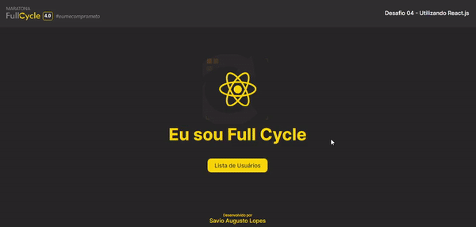

<h1 align="center">
<a href="https://full-cycle.netlify.app/" target="_blank">
  
</a>
</h1>
  
# Desafio 4 - Consumindo API com React.js & Typescript

<br>

Nesse desafio será utilizado React para consumir uma API:
Para isso, primeiro verifique se possui o [Node.js](https://nodejs.org/en/) e, opcionalmente, o gerenciador de pacotes [Yarn](https://yarnpkg.com) instalados.

<br>
Para acessar o deploy da aplicação, segue o link abaixo:<br>
:link: https://full-cycle.netlify.app/
<br>

#### 🧭 Instalando a aplicação

```bash

# Abra seu terminal e instale as depedências da aplicação com o seguinte comando:

$ yarn

# Rode o comando abaixo para visualizar a aplicação em seu navegador:

$ yarn start

```

## 🦸 Autor

[](https://github.com/savio-2-lopes)
[](https://www.instagram.com/savioaugulopes/)
[](https://www.linkedin.com/in/savio-lopes/)
[](mailto:savio.dev.lopes@gmail.com)

Feito com ❤️ por Savio Lopes 👋🏽 [Entre em contato!](https://www.linkedin.com/in/savio-lopes/)

<br>

## 💙 Agradecimentos

Obrigado [Code.Education](https://code.education.com.br/) por disponibilizar esse conteúdo sensacional 🚀.
