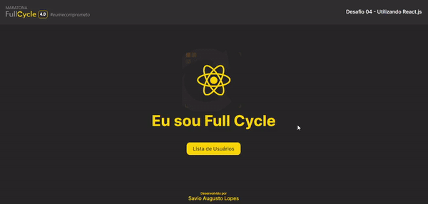

  

 

   
  
  
 
 

 

## :memo: Índice

- [Descrição](#sobre)
- [Desafios](#Desafios)
- [Tecnologias](#tecnologias)
- [Licença](#licenca)
- [Autor](#autor)
- [Agradecimentos](#agradecimentos)

 

## 💻 Descrição

Desafios da Maratona sobre os principais conceitos de Full Cycle e Microsserviços, autenticação utilizando OpenID Connect e desenvolvimento backend e frontend utilizando SPA.

 

 

## ⚙️ Desafios

- [x] D1 - Hello World com Docker
- [x] D2 - Autenticação utilizando Keycloak
- [x] D3 - Trabalhando com Nest.js
- [x] D4 - Utilizando React.js
- [x] D5 - Integração contínua e boas práticas com Github

 

## 🛠 Tecnologias

As seguintes ferramentas foram usadas na construção do projeto:

- [Docker](https://www.docker.com)
- [Go](https://golang.org)
- [NestJS](https://nestjs.com)
- [ReactJS](https://reactjs.org)
- [Keycloak](https://www.keycloak.org)

 

## :memo: Licença

Este projeto está sob a licença do MIT. Veja a [página de licença](https://opensource.org/licenses/MIT) para mais detalhes.

 

## 🦸 Autor

Feito com ❤️ por Savio Lopes 👋🏽 [Entre em contato!](https://www.linkedin.com/in/savio-lopes/)

 

## 💙 Agradecimentos

Obrigado [Code.Education](https://code.education.com.br/) por disponibilizar esse conteúdo sensacional 🚀.
